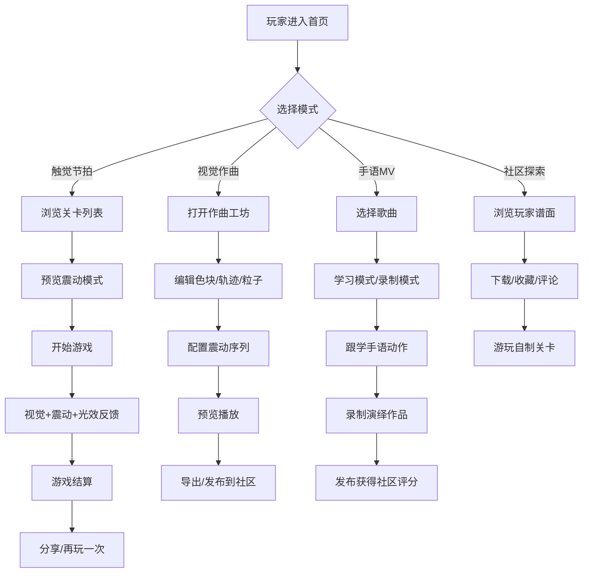

## 1. 产品概述

**Rhythm Vision** - 专为先天性或后天性听障玩家设计的音乐游戏平台。通过将音乐节奏转化为视觉、触觉和动作的多维度反馈系统，打破主流音游对听觉的绝对依赖，为听障游戏爱好者创造专属的音乐游戏生态。

- 解决问题：主流音游完全依赖听觉反馈，听障玩家被系统性排除；现有无障碍游戏多为"简化版"而非"专属设计"
- 目标用户：先天性或后天性听力障碍的游戏爱好者
- 产品价值：创建听障玩家专属的音游文化社区，让音乐体验不再受限于听觉

## 2. 核心功能

### 2.1 用户角色

| 角色 | 注册方式 | 核心权限 |
|------|---------|---------|
| 玩家 | 账号注册/游客登录 | 游玩关卡、创作谱面、录制手语MV、参与社区评分、收藏分享 |
| 创作者 | 玩家升级 | 发布自制关卡、上传震动序列、发布手语演绎作品 |
| 管理员 | 后台管理 | 内容审核、社区管理、音乐库维护 |

### 2.2 功能模块

1. **首页**：特色关卡推荐、热门社区内容、快速开始入口、震动模式预览
2. **触觉节拍游戏**：核心玩法，基于视觉+震动+光效的节奏游戏
3. **视觉作曲工坊**：色块/轨迹/粒子编辑、震动序列创作、导出分享
4. **手语歌词MV**：手语教学、录制演绎、社区评分排行
5. **震动谱面社区**：玩家自制关卡浏览、下载、收藏、评论

### 2.3 页面详情

| 页面名称 | 模块名称 | 功能描述 |
|---------|---------|---------|
| 首页 | Hero区域 | 全屏动态视觉展示、核心功能入口、震动预览演示 |
| 首页 | 特色推荐 | 热门关卡轮播、新发布谱面、编辑精选 |
| 首页 | 社区动态 | 最新手语MV、玩家成就展示、社区活动 |
| 触觉节拍游戏 | 关卡选择 | 难度分级、风格分类、谱面预览、震动模式预览 |
| 触觉节拍游戏 | 游戏核心 | 震动波形条、光频闪烁轨道、角色动作提示、得分判定 |
| 触觉节拍游戏 | 结算界面 | 得分统计、精准度分析、震动反馈复盘、分享功能 |
| 视觉作曲工坊 | 时间轴编辑器 | 多轨道时间轴、色块拖拽、轨迹绘制、粒子效果配置 |
| 视觉作曲工坊 | 震动配置器 | 震动强度曲线、频率调节、波形预览、触觉测试 |
| 视觉作曲工坊 | 作品管理 | 保存草稿、预览播放、导出震动序列、发布到社区 |
| 手语歌词MV | 歌曲库 | 歌曲分类、难度等级、手语表演者信息 |
| 手语歌词MV | 学习模式 | 逐句分解、慢放练习、动作提示、进度跟踪 |
| 手语歌词MV | 录制模式 | 摄像头录制、节奏同步、动作对比、一键发布 |
| 手语歌词MV | 评分排行 | 社区评分、周榜月榜、作品展示、评论互动 |
| 震动谱面社区 | 探索页 | 关卡筛选、热门排行、最新发布、标签搜索 |
| 震动谱面社区 | 谱面详情 | 谱面预览、玩家评价、下载收藏、作者信息 |
| 震动谱面社区 | 创作者中心 | 我的作品、数据统计、粉丝管理、收益概览 |
| 用户中心 | 个人资料 | 头像昵称、成就徽章、游戏统计、偏好设置 |
| 用户中心 | 震动设置 | 震动强度、光效亮度、颜色主题、灵敏度调节 |

## 3. 核心流程

## 4. 用户界面设计

### 4.1 设计风格

- **主色调**：深海蓝 (#0A1628) + 霓虹青 (#00F5FF) + 电光紫 (#A855F7) + 活力橙 (#FF6B35)
- **辅色调**：荧光粉 (#FF00E5)、荧光绿 (#39FF14)、月白 (#F0F4FF)
- **设计理念**：赛博朋克未来主义 × 沉浸式视觉音乐体验 - 用强烈的视觉冲击弥补听觉缺失
- **按钮风格**：霓虹发光边框 + 玻璃拟态背景 + 按下时的震动反馈动画
- **字体**：展示字体使用 "Orbitron"（未来科技感），正文字体使用 "Noto Sans SC"（高可读性中文支持）
- **布局风格**：沉浸式全屏布局、卡片悬浮层次、动态背景粒子系统
- **图标风格**：发光线条图标、几何抽象风格、动效反馈

### 4.2 页面设计概述

| 页面名称 | 模块名称 | UI元素 |
|---------|---------|---------|
| 首页 | Hero区域 | 全屏粒子背景、动态波形动画、发光CTA按钮、呼吸光效 |
| 首页 | 特色推荐 | 卡片悬浮3D效果、霓虹边框、悬停放大、进度条发光 |
| 触觉节拍游戏 | 游戏核心 | 垂直多轨道、下落发光方块、底部判定线、侧边震动波形条、背景光频闪烁 |
| 视觉作曲工坊 | 时间轴编辑器 | 多色轨道、可拖拽色块、贝塞尔轨迹编辑器、粒子预览窗口 |
| 手语歌词MV | 学习模式 | 分屏布局（左侧手语演示+右侧动作提示）、节奏进度条、逐句高亮 |
| 震动谱面社区 | 探索页 | 瀑布流卡片、标签云、实时热度指示器、缩略图动效预览 |

### 4.3 响应式

- 桌面端优先设计，针对大屏游戏体验优化
- 平板端：自适应网格布局，触控按钮放大
- 移动端：简化界面，保留核心游戏与创作功能，触控优化
- 震动反馈：适配移动端震动API，桌面端支持手柄震动

### 4.4 视觉特效设计

- **环境氛围**：深色宇宙背景 + 流动粒子系统 + 音频可视化波形
- **光照设置**：多点霓虹光源、辉光效果、色彩渐变映射
- **动效系统**：
  - 节拍点：屏幕闪烁 + 边框发光脉冲
  - 精准命中：粒子爆炸 + 光效扩散 + 屏幕微震动
  - 连击：数字递增动画 + 轨道渐变加速
  - 震动波形：实时侧边波形条同步跳动
- **后处理效果**：Bloom辉光、动态模糊、色彩分级、扫描线质感
