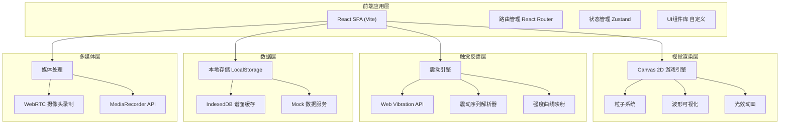
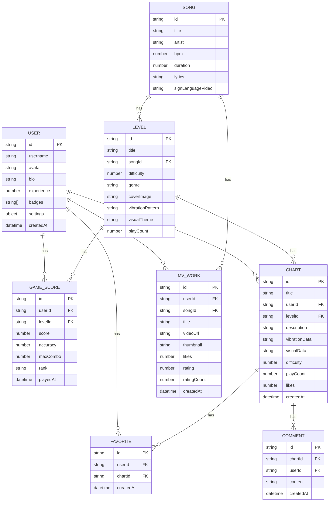

## 1. 架构设计



## 2. 技术描述

- **前端框架**: React@18 + TypeScript
- **构建工具**: Vite@5
- **样式方案**: TailwindCSS@3 + CSS Modules + 自定义 CSS 变量主题系统
- **状态管理**: Zustand (轻量级状态管理，适合游戏状态)
- **路由方案**: React Router@6
- **游戏渲染**: HTML5 Canvas 2D API + 自定义游戏循环
- **动画库**: Framer Motion (UI动效) + Canvas 原生动画
- **图标方案**: 自定义 SVG 图标组件
- **数据持久化**: LocalStorage + IndexedDB
- **Mock数据**: MSW (Mock Service Worker) 或本地 JSON

## 3. 路由定义

| 路由 | 页面组件 | 用途 |
|------|---------|------|
| `/` | HomePage | 首页 - 特色推荐与功能入口 |
| `/game` | GameLandingPage | 触觉节拍游戏 - 关卡选择 |
| `/game/play/:levelId` | GamePlayPage | 触觉节拍游戏 - 游戏核心 |
| `/game/result/:levelId` | GameResultPage | 触觉节拍游戏 - 结算界面 |
| `/workshop` | WorkshopPage | 视觉作曲工坊 |
| `/workshop/create` | WorkshopEditorPage | 视觉作曲 - 编辑器 |
| `/signlanguage` | SignLanguagePage | 手语歌词MV - 歌曲库 |
| `/signlanguage/learn/:songId` | SignLanguageLearnPage | 手语 - 学习模式 |
| `/signlanguage/record/:songId` | SignLanguageRecordPage | 手语 - 录制模式 |
| `/community` | CommunityPage | 震动谱面社区 - 探索 |
| `/community/chart/:chartId` | ChartDetailPage | 谱面详情页 |
| `/community/creator` | CreatorCenterPage | 创作者中心 |
| `/user` | UserProfilePage | 用户中心 - 个人资料 |
| `/user/settings` | UserSettingsPage | 用户中心 - 震动/视觉设置 |

## 4. 数据模型

### 4.1 核心数据模型定义



### 4.2 震动序列数据格式

```typescript
interface VibrationBeat {
  time: number;
  duration: number;
  intensity: number;
  frequency: 'low' | 'mid' | 'high';
  waveform: 'sine' | 'square' | 'sawtooth';
}

interface VibrationSequence {
  version: string;
  bpm: number;
  beats: VibrationBeat[];
  totalDuration: number;
}
```

### 4.3 视觉谱面数据格式

```typescript
interface VisualNote {
  time: number;
  lane: number;
  type: 'tap' | 'hold' | 'slide' | 'swing';
  color: string;
  duration?: number;
  slidePath?: { x: number; y: number }[];
}

interface ParticleEffect {
  triggerTime: number;
  type: 'explosion' | 'wave' | 'sparkle' | 'trail';
  color: string;
  position: { x: number; y: number };
  duration: number;
}

interface VisualChart {
  version: string;
  bpm: number;
  notes: VisualNote[];
  particles: ParticleEffect[];
  backgroundTheme: string;
  totalDuration: number;
}
```
